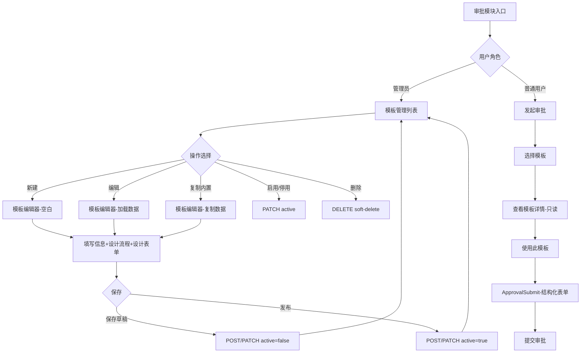

# 审批模板编辑器设计文档

> **版本**: 1.0  
> **日期**: 2026-09-22  
> **状态**: 设计稿  
> **关联文档**: [approval-and-permissions.md](./approval-and-permissions.md)  
> **关联路线图**: P1-4 审批流引擎

---

## 目录

1. [功能范围定义](#1-功能范围定义)
2. [用户场景与交互流程](#2-用户场景与交互流程)
3. [UI 布局设计](#3-ui-布局设计)
4. [数据结构设计](#4-数据结构设计)
5. [组件拆分方案](#5-组件拆分方案)
6. [API 设计](#6-api-设计)
7. [交互细节](#7-交互细节)
8. [边界条件与异常处理](#8-边界条件与异常处理)
9. [技术选型建议](#9-技术选型建议)
10. [实现优先级与迭代计划](#10-实现优先级与迭代计划)

---

## 1. 功能范围定义

### 1.1 核心功能列表

按照 MoSCoW 方法分类：

| 优先级 | 功能 | 说明 |
|--------|------|------|
| **必须做 (Must)** | 模板基本信息编辑 | 名称、描述、图标、分类、审批方式 |
| **必须做 (Must)** | 流程节点编辑 | 审批节点的增删改排序，配置审批人/角色 |
| **必须做 (Must)** | 表单字段定义 | 定义审批表单的字段类型、必填、默认值 |
| **必须做 (Must)** | 实时流程预览 | 编辑时实时展示审批流程图 |
| **必须做 (Must)** | 模板保存与发布 | 保存草稿、发布激活、停用 |
| **必须做 (Must)** | 内置模板复制 | 基于内置模板创建自定义模板 |
| **应该做 (Should)** | 条件分支节点 | 条件判断节点，基于表单数据路由 |
| **应该做 (Should)** | 抄送节点 | 配置抄送人/角色节点 |
| **应该做 (Should)** | 会签模式配置 | any/all/countersign 模式选择 |
| **应该做 (Should)** | 模板分类管理 | 按分类筛选、分类标签 |
| **应该做 (Should)** | 表单字段排序拖拽 | 拖拽调整表单字段顺序 |
| **应该做 (Should)** | 条件表达式可视化编辑 | 非技术用户友好的条件配置 UI |
| **可以做 (Could)** | 节点拖拽排序 | 拖拽方式调整节点顺序 |
| **可以做 (Could)** | 模板版本管理 | 历史版本、版本回滚 |
| **可以做 (Could)** | 模板导入导出 | JSON 格式导入导出模板 |
| **可以做 (Could)** | AI 辅助模板生成 | 根据描述自动生成审批流模板 |
| **可以做 (Could)** | 多级条件嵌套 | 条件节点嵌套条件节点 |

### 1.2 与现有 `ApprovalTemplateManage.tsx` 的关系

**关系：替换（Replace）**

现有 `ApprovalTemplateManage.tsx` 是一个简单的列表 + 弹窗式 CRUD 组件，功能局限：

- 模板列表只展示名称、描述、节点数、启用状态
- 编辑弹窗只支持顺序审批节点的简单配置（名称、审批角色、指定用户）
- 不支持表单字段定义、条件分支、抄送节点、会签模式
- 不支持图标选择、分类管理
- 不支持流程预览

**替换策略**：

1. `ApprovalTemplateManage.tsx` 保留为**模板列表页**，负责模板列表展示、搜索、筛选、启用/停用、删除
2. 新建 `ApprovalTemplateEditor.tsx` 作为**模板编辑器页面**，负责模板的创建和编辑
3. 列表页的"新建模板"和"编辑"按钮跳转到编辑器页面（路由导航），而非弹窗
4. 编辑器页面保存后返回列表页

### 1.3 与 `ApprovalSubmit.tsx` 的关系

**关系：增强（Enhance）**

模板编辑器定义的 `formSchema` 将驱动 `ApprovalSubmit.tsx` 的表单渲染：

- **当前**：`ApprovalSubmit.tsx` 使用自由键值对输入（`contentFields`），用户手动输入字段名和值
- **增强后**：当模板有 `formSchema` 时，`ApprovalSubmit.tsx` 根据 `formSchema` 渲染结构化表单（文本框、数字框、日期选择器等），取代自由键值对
- **无 formSchema 时**：回退到现有的自由键值对模式（兼容）
- **模板节点预览**：`ApprovalSubmit.tsx` 中选中模板后的节点预览，升级为使用 `ApprovalFlowDiagram` 组件展示完整流程图（含条件分支可视化）

数据流：

```
模板编辑器 → formSchema (JSONB) → ApprovalSubmit 动态渲染表单
模板编辑器 → nodes (JSONB) → ApprovalSubmit 流程预览
```

---

## 2. 用户场景与交互流程

### 2.1 场景 A：管理员从零创建新模板

```
入口：审批模块 → 模板管理 → "新建模板" 按钮

步骤 1: 进入模板编辑器（空白状态）
  → 左侧：模板基本信息区（名称、描述、图标、分类、审批方式）
  → 中间：流程设计区（空白，提示"添加第一个节点"）
  → 右侧：表单设计区（空白，提示"添加第一个字段"）

步骤 2: 填写基本信息
  → 输入模板名称（必填）
  → 输入描述（可选）
  → 选择图标（从 Lucide 图标库选择）
  → 选择分类（人事/财务/法务/行政/其他）
  → 选择审批方式（顺序/并行/会签）

步骤 3: 设计审批流程
  → 点击"添加审批节点"
  → 配置节点：名称、审批人（角色或指定用户）、审批模式
  → 可继续添加节点、条件节点、抄送节点
  → 拖拽或按钮调整节点顺序
  → 实时预览流程图

步骤 4: 设计审批表单
  → 点击"添加表单字段"
  → 选择字段类型（文本/数字/日期/单选/多选等）
  → 配置字段属性（标签、必填、默认值、选项列表）
  → 拖拽调整字段顺序

步骤 5: 保存模板
  → 点击"保存草稿"（active=false）或"发布"（active=true）
  → 校验：名称必填、至少一个审批节点、每个审批节点有审批人
  → 保存成功后返回模板列表页
```

### 2.2 场景 B：管理员基于内置模板复制并修改

```
入口：审批模块 → 模板管理 → 内置模板卡片 → "复制" 按钮

步骤 1: 复制内置模板
  → 系统创建一个新模板，复制内置模板的所有配置
  → 新模板名称自动加后缀"（副本）"，isBuiltin=false
  → 自动跳转到模板编辑器，加载复制的模板数据

步骤 2: 修改模板配置
  → 修改名称、描述等基本信息
  → 调整审批节点（增删改）
  → 修改表单字段
  → 调整条件分支

步骤 3: 保存修改后的模板
  → 校验并保存
  → 返回模板列表页
```

### 2.3 场景 C：管理员编辑已有自定义模板

```
入口：审批模块 → 模板管理 → 自定义模板 → "编辑" 按钮

步骤 1: 进入模板编辑器（加载已有数据）
  → 左侧：基本信息区（已填充）
  → 中间：流程设计区（已加载节点配置）
  → 右侧：表单设计区（已加载表单字段）

步骤 2: 修改配置
  → 修改任意区域的配置
  → 实时预览流程图变化

步骤 3: 保存修改
  → 如果模板已被使用（有进行中的审批实例）：
    → 提示"该模板已有进行中的审批实例，修改不影响已发起的审批"
    → 确认后保存
  → 如果模板未被使用：
    → 直接保存
```

### 2.4 场景 D：普通用户查看模板详情（只读）

```
入口：审批模块 → 发起审批 → 选择模板 → 查看模板详情

步骤 1: 查看模板信息
  → 展示模板名称、描述、图标、分类
  → 展示审批流程图（含条件分支可视化）
  → 展示表单字段定义（只读预览）

步骤 2: 基于该模板发起审批
  → 点击"使用此模板"
  → 进入 ApprovalSubmit 表单（根据 formSchema 渲染）
  → 填写表单 → 提交
```

### 2.5 场景交互流程图



---

## 3. UI 布局设计

### 3.1 整体页面结构

模板编辑器采用**三栏布局**，借鉴飞书/钉钉审批模板编辑器的布局思路：

```
┌─────────────────────────────────────────────────────────────────┐
│  顶栏：返回 | 模板名称（实时） | 保存草稿 | 发布                  │
├──────────────┬──────────────────────────┬───────────────────────┤
│              │                          │                       │
│  左栏         │  中栏                     │  右栏                  │
│  基本信息     │  流程设计                  │  表单设计              │
│              │                          │                       │
│  - 名称       │  - 节点列表/画布           │  - 字段列表            │
│  - 描述       │  - 节点配置面板            │  - 字段配置面板         │
│  - 图标       │  - 流程预览图              │                       │
│  - 分类       │                          │                       │
│  - 审批方式   │                          │                       │
│              │                          │                       │
│  宽度: 280px  │  宽度: flex (min 480px)   │  宽度: 320px           │
│              │                          │                       │
├──────────────┴──────────────────────────┴───────────────────────┤
│  底栏：校验提示 | 节点数 | 字段数 | 上次保存时间                    │
└─────────────────────────────────────────────────────────────────┘
```

**响应式策略**：

| 断点 | 布局 | 说明 |
|------|------|------|
| ≥1280px | 三栏并排 | 左栏 + 中栏 + 右栏 |
| 768px–1279px | 两栏 + Tab 切换 | 中栏常驻，左/右栏通过 Tab 切换 |
| <768px | 单栏 + Tab 切换 | 基本信息/流程/表单三个 Tab |

### 3.2 模板基本信息区（左栏）

```
┌──────────────────────┐
│  模板基本信息          │
├──────────────────────┤
│                      │
│  模板名称 *           │
│  ┌──────────────────┐│
│  │ 请假审批          ││
│  └──────────────────┘│
│                      │
│  模板描述             │
│  ┌──────────────────┐│
│  │ 员工请假申请流程  ││
│  └──────────────────┘│
│                      │
│  模板图标             │
│  ┌────┬────┬────┐    │
│  │📝  │✅  │📅  │    │
│  │file│check│cal │    │
│  └────┴────┴────┘    │
│  ┌────┬────┬────┐    │
│  │💰  │📋  │⚙️  │    │
│  └────┴────┴────┘    │
│                      │
│  分类                 │
│  ┌──────────────────┐│
│  │ 人事 ▾           ││
│  └──────────────────┘│
│                      │
│  审批方式             │
│  ○ 顺序审批           │
│  ○ 并行审批           │
│  ○ 会签审批           │
│                      │
└──────────────────────┘
```

**图标选择器**：从 Lucide 图标库中预选 12-16 个与审批场景相关的图标（如 `file-check`, `calendar`, `wallet`, `clipboard`, `settings`, `user-check`, `building`, `shield`, `stamp`, `signature`, `briefcase`, `plane`），以网格方式展示。选中后高亮，图标名存入 `icon` 字段。

**分类下拉**：预设分类选项（人事、财务、法务、行政、采购、其他），也支持自定义输入。

**审批方式**：单选按钮组，选择后影响中栏流程设计的默认节点模式：
- 顺序审批 → 新增节点默认 `mode: "sequential"`
- 并行审批 → 新增节点默认 `mode: "parallel"`
- 会签审批 → 新增节点默认 `mode: "countersign"`，显示 `requiredCount` 配置

### 3.3 流程设计区（中栏）

流程设计区是编辑器的核心，采用**列表式编辑 + 实时预览**的双层设计：

```
┌──────────────────────────────────────────┐
│  流程设计                  [流程预览] ▾   │
├──────────────────────────────────────────┤
│                                          │
│  ┌─────────────────────────────────────┐ │
│  │ ● 开始                               │ │
│  │   ↓                                  │ │
│  │ ┌─────────────────────────────────┐ │ │
│  │ │ ① 主管审批        [审批节点]     │ │ │
│  │ │ 审批人: 直属主管                 │ │ │
│  │ │ 模式: 顺序                       │ │ │
│  │ │ [编辑] [删除] [↑] [↓]            │ │ │
│  │ └─────────────────────────────────┘ │ │
│  │   ↓                                  │ │
│  │ ┌─────────────────────────────────┐ │ │
│  │ │ ◇ 条件判断        [条件节点]     │ │ │
│  │ │ 条件: 请假天数 > 3               │ │ │
│  │ │ → 部门负责人审批                 │ │ │
│  │ │ → 默认: HR审批                   │ │ │
│  │ │ [编辑] [删除]                    │ │ │
│  │ └─────────────────────────────────┘ │ │
│  │   ↓                                  │ │
│  │ ┌─────────────────────────────────┐ │ │
│  │ │ ② HR审批          [审批节点]     │ │ │
│  │ │ 审批人: HR角色                    │ │ │
│  │ │ [编辑] [删除]                    │ │ │
│  │ └─────────────────────────────────┘ │ │
│  │   ↓                                  │ │
│  │ ● 结束                               │ │
│  └─────────────────────────────────────┘ │
│                                          │
│  [+ 添加审批节点] [+ 条件节点] [+ 抄送]   │
│                                          │
├──────────────────────────────────────────┤
│  流程预览（可折叠）                       │
│  ┌─────────────────────────────────────┐ │
│  │  开始 → 主管审批 → 条件判断 → ...    │ │
│  │  (ApprovalFlowDiagram 组件)          │ │
│  └─────────────────────────────────────┘ │
└──────────────────────────────────────────┘
```

**节点卡片设计**：

每种节点类型有独特的视觉标识：

| 节点类型 | 图标 | 边框色 | 标签色 |
|----------|------|--------|--------|
| 审批节点 | `UserCheck` (14px) | `var(--accent)` | `var(--accent-soft)` |
| 条件节点 | `GitBranch` (14px) | `var(--warn)` | `var(--warn-soft)` |
| 抄送节点 | `Send` (14px) | `var(--meta)` | `var(--surface-2)` |
| 开始节点 | `Play` (14px) | `var(--success)` | `var(--success-soft)` |
| 结束节点 | `Square` (14px) | `var(--muted)` | `var(--surface-2)` |

**节点配置面板**（点击节点的"编辑"按钮时展开/弹出）：

审批节点配置面板：

```
┌──────────────────────────────────────┐
│  审批节点配置                          │
├──────────────────────────────────────┤
│  节点名称 *                           │
│  ┌────────────────────────────────┐  │
│  │ 主管审批                       │  │
│  └────────────────────────────────┘  │
│                                      │
│  审批人类型                           │
│  ○ 按角色                             │
│    ┌──────────────────────────────┐  │
│    │ 直属主管 ▾                    │  │
│    └──────────────────────────────┘  │
│  ○ 指定用户                           │
│    ┌──────────────────────────────┐  │
│    │ 选择成员... ▾                 │  │
│    └──────────────────────────────┘  │
│                                      │
│  审批模式                             │
│  ○ 顺序（一人通过即推进）              │
│  ○ 并行（全部通过才推进）              │
│  ○ 会签（N人通过即推进）               │
│    最少通过人数: ┌───┐               │
│                  │ 2 │               │
│                  └───┘               │
│                                      │
│  ── 高级 ──                           │
│  ○ 允许转交                           │
│  ○ 允许加签                           │
│  ○ 允许委托                           │
│                                      │
│  [取消]  [确认]                       │
└──────────────────────────────────────┘
```

条件节点配置面板：

```
┌──────────────────────────────────────┐
│  条件节点配置                          │
├──────────────────────────────────────┤
│  节点名称 *                           │
│  ┌────────────────────────────────┐  │
│  │ 请假天数判断                    │  │
│  └────────────────────────────────┘  │
│                                      │
│  条件分支                             │
│  ┌────────────────────────────────┐  │
│  │ 分支 1: 请假天数 > 3            │  │
│  │   → 目标节点: 部门负责人审批 ▾   │  │
│  │ [删除]                          │  │
│  ├────────────────────────────────┤  │
│  │ 分支 2: 请假天数 ≤ 3 (默认)     │  │
│  │   → 目标节点: HR审批 ▾          │  │
│  │ [删除]                          │  │
│  └────────────────────────────────┘  │
│  [+ 添加分支]                         │
│                                      │
│  条件表达式编辑                        │
│  ┌────────────────────────────────┐  │
│  │ 字段: leaveDays ▾              │  │
│  │ 运算: > ▾                      │  │
│  │ 值: 3                          │  │
│  └────────────────────────────────┘  │
│                                      │
│  [取消]  [确认]                       │
└──────────────────────────────────────┘
```

抄送节点配置面板：

```
┌──────────────────────────────────────┐
│  抄送节点配置                          │
├──────────────────────────────────────┤
│  节点名称 *                           │
│  ┌────────────────────────────────┐  │
│  │ 抄送HR                         │  │
│  └────────────────────────────────┘  │
│                                      │
│  抄送人                               │
│  ○ 按角色                             │
│    ┌──────────────────────────────┐  │
│    │ HR ▾                          │  │
│    └──────────────────────────────┘  │
│  ○ 指定用户                           │
│    ┌──────────────────────────────┐  │
│    │ 选择成员... ▾                 │  │
│    └──────────────────────────────┘  │
│                                      │
│  [取消]  [确认]                       │
└──────────────────────────────────────┘
```

### 3.4 表单设计区（右栏）

```
┌──────────────────────────┐
│  表单设计                  │
├──────────────────────────┤
│                          │
│  ┌────────────────────┐  │
│  │ 📝 请假类型         │  │
│  │ 单选 | 必填         │  │
│  │ [编辑] [删除] [⋮]  │  │
│  └────────────────────┘  │
│                          │
│  ┌────────────────────┐  │
│  │ 📅 请假开始日期     │  │
│  │ 日期 | 必填         │  │
│  │ [编辑] [删除] [⋮]  │  │
│  └────────────────────┘  │
│                          │
│  ┌────────────────────┐  │
│  │ 📅 请假结束日期     │  │
│  │ 日期 | 必填         │  │
│  │ [编辑] [删除] [⋮]  │  │
│  └────────────────────┘  │
│                          │
│  ┌────────────────────┐  │
│  │ 🔢 请假天数         │  │
│  │ 数字 | 只读(自动)   │  │
│  │ [编辑] [删除] [⋮]  │  │
│  └────────────────────┘  │
│                          │
│  ┌────────────────────┐  │
│  │ 📝 请假事由         │  │
│  │ 多行文本 | 必填     │  │
│  │ [编辑] [删除] [⋮]  │  │
│  └────────────────────┘  │
│                          │
│  [+ 添加字段]             │
│                          │
└──────────────────────────┘
```

**字段配置面板**（点击"编辑"时展开）：

```
┌──────────────────────────────────────┐
│  字段配置                              │
├──────────────────────────────────────┤
│  字段标签 *                           │
│  ┌────────────────────────────────┐  │
│  │ 请假类型                       │  │
│  └────────────────────────────────┘  │
│                                      │
│  字段标识 *                           │
│  ┌────────────────────────────────┐  │
│  │ leaveType                      │  │
│  └────────────────────────────────┘  │
│  (用于条件表达式引用，自动生成)        │
│                                      │
│  字段类型                             │
│  ┌────────────────────────────────┐  │
│  │ 单选 ▾                          │  │
│  └────────────────────────────────┘  │
│  (文本/数字/日期/单选/多选/多行文本)   │
│                                      │
│  ── 单选选项 ──                       │
│  ┌────────────────────────────────┐  │
│  │ 事假                            │  │
│  │ 病假                            │  │
│  │ 年假                            │  │
│  │ 婚假                            │  │
│  │ [+ 添加选项]                    │  │
│  └────────────────────────────────┘  │
│                                      │
│  □ 必填                               │
│  □ 只读                               │
│                                      │
│  默认值                               │
│  ┌────────────────────────────────┐  │
│  │ (空)                           │  │
│  └────────────────────────────────┘  │
│                                      │
│  占位提示                             │
│  ┌────────────────────────────────┐  │
│  │ 请选择请假类型                  │  │
│  └────────────────────────────────┘  │
│                                      │
│  [取消]  [确认]                       │
└──────────────────────────────────────┘
```

### 3.5 预览区

预览区集成在中栏底部（可折叠展开），使用增强版 `ApprovalFlowDiagram` 组件实时渲染当前节点配置的流程图。

预览模式有两种：
1. **流程图模式**（默认）：水平节点链 + 条件分支可视化
2. **表单预览模式**：模拟用户发起审批时的表单界面

切换按钮位于预览区顶部右上角。

---

## 4. 数据结构设计

### 4.1 `formSchema` 的 JSON 结构定义

`formSchema` 定义审批表单的结构，存储在 `ApprovalTemplate.formSchema` 字段（JSONB）。

```typescript
interface FormSchema {
  /** 表单版本号，用于后续 schema 升级兼容 */
  version: 1;
  /** 字段列表（有序） */
  fields: FormField[];
}

interface FormField {
  /** 字段唯一标识（用于条件表达式引用，如 "leaveDays"） */
  key: string;
  /** 字段标签（用户可见名称，如 "请假天数"） */
  label: string;
  /** 字段类型 */
  type: FormFieldType;
  /** 是否必填 */
  required: boolean;
  /** 是否只读（自动计算或不可修改） */
  readonly?: boolean;
  /** 默认值 */
  defaultValue?: string | number | boolean | null;
  /** 占位提示文本 */
  placeholder?: string;
  /** 选项列表（仅 select/multiselect 类型） */
  options?: FormFieldOption[];
  /** 最小值（仅 number 类型） */
  min?: number;
  /** 最大值（仅 number 类型） */
  max?: number;
  /** 最小长度（仅 text/textarea 类型） */
  minLength?: number;
  /** 最大长度（仅 text/textarea 类型） */
  maxLength?: number;
  /** 帮助文本 */
  helpText?: string;
}

type FormFieldType =
  | "text"         // 单行文本
  | "textarea"     // 多行文本
  | "number"       // 数字
  | "date"         // 日期
  | "datetime"     // 日期时间
  | "select"       // 单选下拉
  | "multiselect"  // 多选下拉
  | "radio"        // 单选按钮组
  | "checkbox"     // 复选框
  | "boolean"      // 是/否开关
  | "currency"     // 金额（带货币符号）
  | "file";        // 附件上传（Phase 2）

interface FormFieldOption {
  /** 选项值（存储值） */
  value: string;
  /** 选项标签（显示值） */
  label: string;
}
```

**示例 formSchema**：

```json
{
  "version": 1,
  "fields": [
    {
      "key": "leaveType",
      "label": "请假类型",
      "type": "select",
      "required": true,
      "options": [
        { "value": "personal", "label": "事假" },
        { "value": "sick", "label": "病假" },
        { "value": "annual", "label": "年假" },
        { "value": "marriage", "label": "婚假" }
      ],
      "placeholder": "请选择请假类型"
    },
    {
      "key": "leaveStart",
      "label": "请假开始日期",
      "type": "date",
      "required": true
    },
    {
      "key": "leaveEnd",
      "label": "请假结束日期",
      "type": "date",
      "required": true
    },
    {
      "key": "leaveDays",
      "label": "请假天数",
      "type": "number",
      "required": true,
      "readonly": true,
      "helpText": "系统自动计算"
    },
    {
      "key": "reason",
      "label": "请假事由",
      "type": "textarea",
      "required": true,
      "maxLength": 500,
      "placeholder": "请简要说明请假原因"
    }
  ]
}
```

### 4.2 `nodes` 的增强结构

**兼容策略**：保持扁平数组格式，同时支持图结构字段。

现有 `nodes` 格式（扁平数组）已被 `ApprovalInstance` 使用并做节点快照。为了**向后兼容**，模板编辑器输出的 `nodes` 仍然使用扁平数组格式，但每个节点增加 `id`、`type`、`conditions`、`ccUserIds`、`ccRole`、`mode`、`requiredCount` 等字段。

```typescript
interface TemplateNode {
  /** 节点唯一 ID（编辑器生成，如 "node-1", "node-2"） */
  id: string;
  /** 节点类型 */
  type: "approval" | "condition" | "cc";
  /** 节点名称 */
  name: string;
  /** 排序序号（兼容现有逻辑，从 1 开始） */
  order: number;

  // ── 审批节点字段（type="approval"） ──
  /** 审批人角色 */
  approverRole?: string | null;
  /** 审批人用户 ID */
  approverUserId?: string | null;
  /** 审批人用户 ID 列表（多审批人场景） */
  approverIds?: string[];
  /** 审批模式 */
  mode?: "sequential" | "parallel" | "countersign";
  /** 会签模式最少通过数 */
  requiredCount?: number;

  // ── 抄送节点字段（type="cc"） ──
  /** 抄送人用户 ID 列表 */
  ccUserIds?: string[];
  /** 抄送角色 */
  ccRole?: string | null;

  // ── 条件节点字段（type="condition"） ──
  /** 条件分支列表 */
  conditions?: ConditionBranch[];
}

interface ConditionBranch {
  /** 分支标签 */
  label: string;
  /** JSON Logic 表达式 */
  expression: object;
  /** 满足条件时跳转的目标节点 ID */
  targetNodeId: string;
}
```

**与现有格式的兼容性**：

| 现有字段 | 增强后 | 说明 |
|----------|--------|------|
| `name` | `name` | 不变 |
| `order` | `order` | 不变 |
| `approverRole` | `approverRole` | 不变 |
| `approverUserId` | `approverUserId` | 不变 |
| — | `id` | 新增，编辑器生成 |
| — | `type` | 新增，默认 "approval" |
| — | `approverIds` | 新增，多审批人 |
| — | `mode` | 新增，审批模式 |
| — | `requiredCount` | 新增，会签配置 |
| — | `ccUserIds` | 新增，抄送人 |
| — | `ccRole` | 新增，抄送角色 |
| — | `conditions` | 新增，条件分支 |

**向后兼容逻辑**：
- 读取旧模板时，`type` 缺失则默认为 `"approval"`
- `id` 缺失时，按 `order` 自动生成 `"node-{order}"`
- `mode` 缺失时，默认为 `"sequential"`
- `conditions` 缺失时，条件节点按 `order` 顺序连接到下一个节点

### 4.3 条件节点的 `condition` 表达式格式

使用 json-logic-js 格式，条件表达式存储在 `ConditionBranch.expression` 中。

**常见条件表达式示例**：

```json
// 请假天数 > 3
{ ">": [{ "var": "leaveDays" }, 3] }

// 请假类型 == "病假"
{ "==": [{ "var": "leaveType" }, "sick"] }

// 金额 >= 5000 且 金额 <= 50000
{ "and": [
  { ">=": [{ "var": "amount" }, 5000] },
  { "<=": [{ "var": "amount" }, 50000] }
]}

// 请假类型 == "事假" 或 请假类型 == "病假"
{ "or": [
  { "==": [{ "var": "leaveType" }, "personal"] },
  { "==": [{ "var": "leaveType" }, "sick"] }
]}

// 默认分支（总是满足）
true
```

**条件分支求值规则**（与现有 `condition-engine.ts` 一一致）：
- 按 `conditions` 数组顺序求值
- 返回第一个满足条件的分支的 `targetNodeId`
- 如果无匹配，返回最后一个分支的 `targetNodeId`（默认分支）
- 求值异常时返回默认分支

### 4.4 模板版本管理

**Phase 1 不实现版本管理**，但数据结构预留版本号字段：

```typescript
// formSchema 已有 version 字段
interface FormSchema {
  version: 1;  // 当前版本
  fields: FormField[];
}

// nodes 不需要版本号，因为 ApprovalInstance 会做节点快照
// 模板修改不影响已发起的审批实例
```

**模板被使用后的修改策略**：

| 场景 | 策略 |
|------|------|
| 模板有进行中的审批实例 | 允许修改，提示"修改不影响已发起的审批" |
| 模板无审批实例 | 自由修改 |
| 内置模板 | 不可修改，只能复制后修改 |

ApprovalInstance 的 `nodes` 字段是模板的**快照副本**（创建实例时从模板复制），因此模板修改不会影响已发起的审批实例。这是现有的设计，无需改变。

---

## 5. 组件拆分方案

### 5.1 需要新建的组件

| 文件路径 | 职责 | 优先级 |
|----------|------|--------|
| `web/components/approval/editor/ApprovalTemplateEditor.tsx` | 编辑器主组件，三栏布局，状态管理 | P1 |
| `web/components/approval/editor/TemplateBasicInfo.tsx` | 左栏：模板基本信息编辑 | P1 |
| `web/components/approval/editor/TemplateFlowDesigner.tsx` | 中栏：流程节点列表 + 添加按钮 | P1 |
| `web/components/approval/editor/TemplateFormDesigner.tsx` | 右栏：表单字段列表 + 添加按钮 | P1 |
| `web/components/approval/editor/NodeCard.tsx` | 节点卡片（审批/条件/抄送），展示+操作 | P1 |
| `web/components/approval/editor/ApprovalNodeConfig.tsx` | 审批节点配置面板（弹窗/抽屉） | P1 |
| `web/components/approval/editor/ConditionNodeConfig.tsx` | 条件节点配置面板 | P2 |
| `web/components/approval/editor/CcNodeConfig.tsx` | 抄送节点配置面板 | P2 |
| `web/components/approval/editor/FormFieldCard.tsx` | 表单字段卡片，展示+操作 | P1 |
| `web/components/approval/editor/FormFieldConfig.tsx` | 字段配置面板（弹窗/抽屉） | P1 |
| `web/components/approval/editor/IconPicker.tsx` | 图标选择器 | P1 |
| `web/components/approval/editor/TemplatePreview.tsx` | 流程预览组件（复用 ApprovalFlowDiagram） | P1 |
| `web/components/approval/editor/ConditionBuilder.tsx` | 条件表达式可视化编辑器 | P2 |
| `web/lib/approval/template-validator.ts` | 模板校验逻辑（节点、表单、条件） | P1 |
| `web/lib/approval/template-types.ts` | 模板编辑器 TypeScript 类型定义 | P1 |

### 5.2 需要修改的现有组件

| 文件路径 | 修改内容 | 优先级 |
|----------|----------|--------|
| `web/components/approval/ApprovalTemplateManage.tsx` | 1. "新建模板"按钮改为路由跳转到编辑器页面<br>2. "编辑"按钮改为路由跳转<br>3. 增加"复制"按钮（内置模板）<br>4. 列表展示图标和分类<br>5. 移除内嵌的 `TemplateEditDialog` | P1 |
| `web/components/approval/ApprovalSubmit.tsx` | 1. 选中模板后根据 `formSchema` 渲染结构化表单<br>2. 无 `formSchema` 时回退到自由键值对<br>3. 节点预览升级为流程图 | P2 |
| `web/components/approval/ApprovalFlowDiagram.tsx` | 1. 支持条件分支节点可视化<br>2. 支持抄送节点展示<br>3. 支持会签模式标识 | P2 |
| `web/messages/zh.json` | 增加 `approval.editor.*` 命名空间的 i18n key | P1 |
| `web/messages/en.json` | 增加 `approval.editor.*` 命名空间的 i18n key | P1 |

### 5.3 状态管理方案

**选择：React Context + useReducer**

模板编辑器是一个**局部复杂状态**场景，不需要全局状态管理（如 zustand）。使用 React Context + useReducer 的理由：

1. 编辑器状态只在编辑器组件树内使用，不需要跨页面共享
2. 编辑器状态结构复杂（基本信息 + 节点列表 + 表单字段列表），需要统一管理
3. useReducer 提供清晰的状态变更追踪和调试能力
4. 避免 zustand 的额外依赖和全局 store 污染

**状态结构**：

```typescript
interface TemplateEditorState {
  // 基本信息
  name: string;
  description: string;
  icon: string;
  category: string;
  flowType: "sequential" | "parallel" | "countersign";

  // 流程节点
  nodes: TemplateNode[];

  // 表单字段
  formSchema: FormSchema;

  // 元状态
  isDirty: boolean;           // 是否有未保存修改
  isSaving: boolean;          // 是否正在保存
  errors: ValidationError[];  // 校验错误列表
  templateId: string | null;  // 编辑模式时的模板 ID
  isBuiltin: boolean;         // 是否内置模板（只读限制）
}

type TemplateEditorAction =
  | { type: "SET_NAME"; payload: string }
  | { type: "SET_DESCRIPTION"; payload: string }
  | { type: "SET_ICON"; payload: string }
  | { type: "SET_CATEGORY"; payload: string }
  | { type: "SET_FLOW_TYPE"; payload: "sequential" | "parallel" | "countersign" }
  | { type: "ADD_NODE"; payload: TemplateNode }
  | { type: "UPDATE_NODE"; payload: { id: string; changes: Partial<TemplateNode> } }
  | { type: "REMOVE_NODE"; payload: string }
  | { type: "REORDER_NODES"; payload: TemplateNode[] }
  | { type: "ADD_FIELD"; payload: FormField }
  | { type: "UPDATE_FIELD"; payload: { key: string; changes: Partial<FormField> } }
  | { type: "REMOVE_FIELD"; payload: string }
  | { type: "REORDER_FIELDS"; payload: FormField[] }
  | { type: "SET_ERRORS"; payload: ValidationError[] }
  | { type: "SET_SAVING"; payload: boolean }
  | { type: "MARK_CLEAN" }
  | { type: "LOAD_TEMPLATE"; payload: TemplateEditorState }
  | { type: "RESET" };
```

**Context 结构**：

```typescript
// web/components/approval/editor/TemplateEditorContext.tsx
const TemplateEditorContext = createContext<{
  state: TemplateEditorState;
  dispatch: Dispatch<TemplateEditorAction>;
} | null>(null);

function templateEditorReducer(
  state: TemplateEditorState,
  action: TemplateEditorAction
): TemplateEditorState {
  switch (action.type) {
    case "SET_NAME":
      return { ...state, name: action.payload, isDirty: true };
    case "ADD_NODE":
      return { ...state, nodes: [...state.nodes, action.payload], isDirty: true };
    // ... 其他 case
    default:
      return state;
  }
}
```

**数据流**：

```
ApprovalTemplateEditor (Provider)
  ├── TemplateBasicInfo (Consumer - 读写基本信息)
  ├── TemplateFlowDesigner (Consumer - 读写节点列表)
  │   ├── NodeCard (Consumer - 读节点数据)
  │   │   └── ApprovalNodeConfig / ConditionNodeConfig / CcNodeConfig
  │   └── TemplatePreview (Consumer - 读节点数据)
  └── TemplateFormDesigner (Consumer - 读写表单字段)
      ├── FormFieldCard (Consumer - 读字段数据)
      │   └── FormFieldConfig
      └── IconPicker (独立组件，无 Context 依赖)
```

---

## 6. API 设计

### 6.1 现有 API 兼容性

现有 API 已支持模板 CRUD，但 `createTemplateSchema` 和 `updateTemplateSchema` 的 zod 校验过于简单，需要扩展以支持新增字段。

### 6.2 需要修改的 API

**`POST /api/v1/workspaces/{wid}/approvals/templates`** — 创建模板

请求体扩展：

```typescript
{
  name: string;                    // 必填，1-200 字符
  description?: string;            // 可选，最多 500 字符
  icon?: string;                   // 可选，默认 "file-check"
  category?: string;               // 可选
  flowType?: string;               // 可选，默认 "sequential"
  formSchema?: FormSchema;         // 可选
  nodes: TemplateNode[];           // 必填，至少 1 个节点
  active?: boolean;                // 可选，默认 true
}
```

zod schema 更新：

```typescript
const createTemplateSchema = z.object({
  name: z.string().min(1).max(200),
  description: z.string().max(500).optional(),
  icon: z.string().max(50).optional(),
  category: z.string().max(50).optional(),
  flowType: z.enum(["sequential", "parallel", "countersign"]).optional(),
  formSchema: z.object({
    version: z.literal(1),
    fields: z.array(formFieldSchema).max(50),
  }).optional(),
  nodes: z.array(templateNodeSchema).min(1).max(30),
  active: z.boolean().optional(),
});

const formFieldSchema = z.object({
  key: z.string().min(1).max(50).regex(/^[a-zA-Z][a-zA-Z0-9_]*$/),
  label: z.string().min(1).max(100),
  type: z.enum([
    "text", "textarea", "number", "date", "datetime",
    "select", "multiselect", "radio", "checkbox", "boolean", "currency", "file"
  ]),
  required: z.boolean().default(false),
  readonly: z.boolean().optional(),
  defaultValue: z.union([z.string(), z.number(), z.boolean(), z.null()]).optional(),
  placeholder: z.string().max(200).optional(),
  options: z.array(z.object({
    value: z.string(),
    label: z.string(),
  })).optional(),
  min: z.number().optional(),
  max: z.number().optional(),
  minLength: z.number().optional(),
  maxLength: z.number().optional(),
  helpText: z.string().max(200).optional(),
});

const templateNodeSchema = z.object({
  id: z.string().min(1).max(50),
  type: z.enum(["approval", "condition", "cc"]),
  name: z.string().min(1).max(200),
  order: z.number().int().min(1),
  // 审批节点
  approverRole: z.string().optional(),
  approverUserId: z.string().optional(),
  approverIds: z.array(z.string()).optional(),
  mode: z.enum(["sequential", "parallel", "countersign"]).optional(),
  requiredCount: z.number().int().min(1).optional(),
  // 抄送节点
  ccUserIds: z.array(z.string()).optional(),
  ccRole: z.string().optional(),
  // 条件节点
  conditions: z.array(z.object({
    label: z.string(),
    expression: z.record(z.any()),
    targetNodeId: z.string(),
  })).optional(),
});
```

**`PATCH /api/v1/workspaces/{wid}/approvals/templates/{tid}`** — 更新模板

请求体扩展（所有字段可选）：

```typescript
{
  name?: string;
  description?: string | null;
  icon?: string;
  category?: string | null;
  flowType?: string;
  formSchema?: FormSchema | null;
  nodes?: TemplateNode[];
  active?: boolean;
}
```

### 6.3 需要新增的 API

**`POST /api/v1/workspaces/{wid}/approvals/templates/{tid}/clone`** — 复制内置模板

```typescript
// 请求：无 body
// 响应：
{
  code: 201,
  data: {
    id: string;           // 新模板 ID
    name: string;         // 原名称 + "（副本）"
    description: string;
    icon: string;
    category: string;
    flowType: string;
    formSchema: FormSchema | null;
    nodes: TemplateNode[];
    isBuiltin: false;
    active: true;
  }
}
```

逻辑：
1. 查找源模板（必须存在且属于当前工作区）
2. 创建新模板，复制所有字段，`name` 加后缀"（副本）"，`isBuiltin=false`
3. 返回新模板数据

### 6.4 API 校验增强

在 API 路由中增加以下校验逻辑（在 zod 校验之后）：

1. **节点 ID 唯一性**：`nodes` 数组中 `id` 不能重复
2. **条件节点目标有效性**：`conditions[].targetNodeId` 必须指向 `nodes` 数组中存在的节点 ID
3. **审批节点审批人**：`type="approval"` 的节点必须至少有 `approverRole` 或 `approverUserId` 或 `approverIds` 之一
4. **抄送节点抄送人**：`type="cc"` 的节点必须至少有 `ccUserIds` 或 `ccRole` 之一
5. **条件节点分支数**：`type="condition"` 的节点至少有 2 个 `conditions`（一个条件分支 + 一个默认分支）
6. **表单字段 key 唯一性**：`formSchema.fields` 中 `key` 不能重复
7. **循环依赖检测**：条件节点的 `targetNodeId` 不能形成环（使用 DFS 检测）

---

## 7. 交互细节

### 7.1 拖拽排序实现方案

**节点排序**：Phase 1 使用按钮排序（ArrowUp/ArrowDown），Phase 2 升级为拖拽排序。

**表单字段排序**：Phase 1 使用按钮排序，Phase 2 升级为拖拽排序。

**拖拽库选型**：`@dnd-kit/core` + `@dnd-kit/sortable`

选择理由：
- `@dnd-kit` 是 React 生态最活跃的拖拽库，支持 React 19
- `react-beautiful-dnd` 已停止维护（atlassian 官方声明）
- `@dnd-kit` 体积小（~10KB gzipped），API 灵活
- 支持键盘无障碍操作（内置 `useSortable` keyboard sensor）

**Phase 2 拖拽实现方案**：

```typescript
// 节点排序
import { DndContext, closestCenter, KeyboardSensor, useSensor, useSensors } from "@dnd-kit/core";
import { SortableContext, verticalListSortingStrategy, useSortable } from "@dnd-kit/sortable";

function SortableNodeCard({ node }: { node: TemplateNode }) {
  const { attributes, listeners, setNodeRef, transform, transition } = useSortable({
    id: node.id,
  });

  return (
    <div ref={setNodeRef} style={{ transform: CSS.Transform.toString(transform), transition }}>
      <NodeCard node={node} dragHandleProps={{ ...attributes, ...listeners }} />
    </div>
  );
}
```

### 7.2 条件表达式可视化编辑器

**目标**：让非技术用户无需编写 JSON Logic 即可配置条件分支。

**`ConditionBuilder` 组件设计**：

采用**规则行（Rule Row）**模式，每行表示一个条件：

```
┌──────────────────────────────────────────────────────┐
│  条件分支 1                                           │
│  ┌────────────┐ ┌──────────┐ ┌────────────┐         │
│  │ 请假天数 ▾ │ │ 大于 ▾   │ │ 3          │ [删除]  │
│  └────────────┘ └──────────┘ └────────────┘         │
│                                                      │
│  ┌────────────┐ ┌──────────┐ ┌────────────┐         │
│  │ 请假类型 ▾ │ │ 等于 ▾   │ │ 事假 ▾     │ [删除]  │
│  └────────────┘ └──────────┘ └────────────┘         │
│                                                      │
│  [且] [或]  [+ 添加条件]                              │
│                                                      │
│  满足以上条件时 → 跳转到: [部门负责人审批 ▾]          │
├──────────────────────────────────────────────────────┤
│  条件分支 2 (默认)                                    │
│  不满足以上任何条件时 → 跳转到: [HR审批 ▾]            │
├──────────────────────────────────────────────────────┤
│  [+ 添加分支]                                         │
└──────────────────────────────────────────────────────┘
```

**字段选择器**：下拉列表展示 `formSchema.fields` 中所有字段的 `label`，选中后绑定 `key`。

**运算符选择器**：根据字段类型自动过滤可用运算符：

| 字段类型 | 可用运算符 |
|----------|-----------|
| number / currency | 等于、不等于、大于、大于等于、小于、小于等于 |
| text / textarea | 等于、不等于、包含、不包含、为空、不为空 |
| date / datetime | 等于、早于、晚于、早于等于、晚于等于 |
| select / radio | 等于、不等于 |
| multiselect / checkbox | 包含、不包含 |
| boolean | 等于 |

**值输入器**：根据字段类型和运算符渲染不同的输入控件：
- number/currency → 数字输入框
- text → 文本输入框
- date/datetime → 日期选择器
- select/radio → 下拉选择（使用字段的 `options`）
- boolean → 是/否开关

**组合逻辑**：多个条件之间支持"且"（and）/"或"（or）组合，UI 上用按钮切换。

**JSON Logic 生成**：`ConditionBuilder` 将用户配置转化为 JSON Logic 表达式：

```
用户配置:
  请假天数 > 3 (且) 请假类型 == "事假"

生成的 JSON Logic:
  { "and": [
    { ">": [{ "var": "leaveDays" }, 3] },
    { "==": [{ "var": "leaveType" }, "personal"] }
  ]}
```

**JSON Logic 解析**：编辑模式下，`ConditionBuilder` 将 JSON Logic 表达式逆向解析为 UI 规则行。

### 7.3 表单字段的添加/删除/排序交互

**添加字段**：
1. 点击"+ 添加字段"按钮
2. 弹出字段类型选择面板（网格展示所有可用类型，带图标）
3. 选择类型后创建默认字段配置，自动生成 `key`（如 `field_1`, `field_2`）
4. 自动展开字段配置面板，引导用户填写 `label`

**删除字段**：
1. 点击字段卡片的"删除"按钮
2. 如果字段已被条件表达式引用，提示"该字段被条件节点引用，删除后条件表达式将失效"
3. 确认后删除，同时清理条件表达式中的引用

**排序字段**：
- Phase 1：每个字段卡片右侧有上移/下移按钮
- Phase 2：拖拽排序（`@dnd-kit/sortable`）

### 7.4 节点的添加/删除/连接交互

**添加节点**：
1. 在节点列表底部有"+ 添加审批节点"、"+ 条件节点"、"+ 抄送"三个按钮
2. 点击后创建默认节点配置，自动分配 `id` 和 `order`
3. 自动展开节点配置面板

**删除节点**：
1. 点击节点卡片的"删除"按钮
2. 如果是条件节点的 `targetNodeId` 指向的节点，提示"该节点被条件分支引用"
3. 确认后删除，同时更新 `order` 序号

**节点连接关系**：
- 顺序审批：按 `order` 自动连接
- 条件分支：条件节点的 `conditions[].targetNodeId` 定义连接
- 并行审批：同一 `order` 的多个节点并行执行（Phase 2）

### 7.5 保存/发布/草稿的状态流转

```
┌─────────────┐
│  编辑中      │ (isDirty=true)
│  (Draft)     │
└──────┬──────┘
       │
       ├──── "保存草稿" ──→ POST/PATCH { active: false }
       │                     │
       │                     ↓
       │               ┌─────────────┐
       │               │  草稿状态    │ (active=false)
       │               │  (Draft)     │
       │               └──────┬──────┘
       │                      │
       │                      ├──── "编辑" ──→ 回到编辑中
       │                      ├──── "发布" ──→ PATCH { active: true }
       │                      │                  │
       │                      │                  ↓
       │                      │            ┌─────────────┐
       │                      │            │  已发布      │ (active=true)
       │                      │            │  (Published) │
       │                      │            └──────┬──────┘
       │                      │                   │
       │                      │                   ├──── "停用" ──→ PATCH { active: false }
       │                      │                   ├──── "编辑" ──→ 回到编辑中
       │                      │                   └──── "删除" ──→ DELETE (soft-delete)
       │                      │
       └──── "发布" ──→ POST/PATCH { active: true }
                         │
                         ↓
                   ┌─────────────┐
                   │  已发布      │ (active=true)
                   │  (Published) │
                   └─────────────┘
```

**校验时机**：
- 保存草稿：仅校验名称不为空
- 发布：完整校验（名称、节点、审批人、条件分支、表单字段）

**离开页面保护**：
- `isDirty=true` 时，尝试离开页面（路由跳转、关闭标签页）时弹出确认对话框
- 使用 `beforeunload` 事件 + Next.js 路由拦截

---

## 8. 边界条件与异常处理

### 8.1 数量上限

| 维度 | 上限 | 说明 |
|------|------|------|
| 节点数 | 30 | 单模板最多 30 个节点（API zod 校验 `max(30)`） |
| 表单字段数 | 50 | 单模板最多 50 个表单字段 |
| 条件分支数 | 10 | 单条件节点最多 10 个分支 |
| 条件嵌套深度 | 3 | 条件表达式最多嵌套 3 层（and/or 嵌套） |
| 选项数 | 20 | 单选/多选字段最多 20 个选项 |
| 模板名称 | 200 字符 | 数据库 `VarChar(200)` |
| 模板描述 | 500 字符 | 数据库 `VarChar(500)` |
| 字段标签 | 100 字符 | UI 显示约束 |
| 字段 key | 50 字符 | 标识符约束 |

### 8.2 循环依赖检测

条件节点的 `targetNodeId` 不能形成环。检测算法：

```typescript
function detectCycle(nodes: TemplateNode[]): boolean {
  // 构建邻接表
  const adjacency = new Map<string, string[]>();
  for (const node of nodes) {
    if (node.type === "condition" && node.conditions) {
      adjacency.set(node.id, node.conditions.map(c => c.targetNodeId));
    } else {
      // 非条件节点按 order 连接到下一个节点
      const nextNode = nodes.find(n => n.order === node.order + 1);
      if (nextNode) {
        adjacency.set(node.id, [nextNode.id]);
      }
    }
  }

  // DFS 检测环
  const visited = new Set<string>();
  const recursionStack = new Set<string>();

  function dfs(nodeId: string): boolean {
    visited.add(nodeId);
    recursionStack.add(nodeId);

    const neighbors = adjacency.get(nodeId) ?? [];
    for (const neighbor of neighbors) {
      if (!visited.has(neighbor)) {
        if (dfs(neighbor)) return true;
      } else if (recursionStack.has(neighbor)) {
        return true; // 发现环
      }
    }

    recursionStack.delete(nodeId);
    return false;
  }

  for (const node of nodes) {
    if (!visited.has(node.id)) {
      if (dfs(node.id)) return true;
    }
  }

  return false;
}
```

### 8.3 模板被使用后能否修改

**策略：允许修改，但提示用户**

- `ApprovalInstance.nodes` 是模板创建时的**快照副本**，模板修改不影响已发起的审批实例
- 编辑已有模板时，如果该模板有 `status="pending"` 的审批实例，在编辑器顶部显示提示条：

  > "该模板当前有 N 个进行中的审批实例。修改模板不会影响已发起的审批。"

- 内置模板（`isBuiltin=true`）不可编辑，只能"复制"后编辑

### 8.4 条件表达式异常处理

| 异常场景 | 处理策略 |
|----------|----------|
| 条件表达式格式错误 | `validateConditionExpression()` 返回 false，编辑器标红提示 |
| 条件引用的字段不存在 | 编辑器检测 `formSchema.fields` 中是否有对应 `key`，缺失则提示 |
| 条件求值运行时异常 | `evaluateCondition()` 已有 try-catch，返回默认分支 |
| `targetNodeId` 指向不存在的节点 | API 校验拒绝，编辑器标红提示 |

### 8.5 表单字段 key 冲突

- `formSchema.fields` 中 `key` 必须唯一
- 编辑器实时检测 key 重复，重复时标红提示
- 自动生成的 key 格式：`field_1`, `field_2`, ...（递增序号）
- 用户可手动修改 key，但必须符合 `^[a-zA-Z][a-zA-Z0-9_]*$` 正则

### 8.6 空模板处理

- 新建模板时，`nodes` 为空数组，`formSchema.fields` 为空数组
- 编辑器中间区域显示空状态提示："点击下方按钮添加第一个审批节点"
- 保存时校验：至少 1 个审批节点（`nodes.length >= 1`）

---

## 9. 技术选型建议

### 9.1 拖拽库：`@dnd-kit/core` + `@dnd-kit/sortable`

| 候选 | 优点 | 缺点 | 结论 |
|------|------|------|------|
| `@dnd-kit` | React 19 兼容、活跃维护、体积小、无障碍支持 | API 较底层，需自定义样式 | **推荐** |
| `react-beautiful-dnd` | API 简洁、开箱即用 | 已停止维护、不支持 React 19 | 不推荐 |
| 自实现 HTML5 Drag | 零依赖、完全可控 | 开发量大、无障碍支持差、移动端不兼容 | 不推荐 |

### 9.2 流程图可视化：升级现有 `ApprovalFlowDiagram.tsx`

现有 `ApprovalFlowDiagram` 是简单的水平节点链渲染，不支持条件分支和抄送节点。

**升级方案**：

| 维度 | 现状 | 升级目标 |
|------|------|----------|
| 节点类型 | 仅审批节点 | 审批 + 条件 + 抄送 + 开始 + 结束 |
| 条件分支 | 不支持 | 菱形节点 + 分支标签 + 分叉连线 |
| 抄送节点 | 不支持 | 信封图标节点 |
| 布局 | 水平线性 | 水平 + 垂直分叉（条件分支处） |
| 交互 | 只读 | 可点击节点查看详情 |

**不引入第三方流程图库**（如 ReactFlow、X6）的理由：
- 审批流程图结构相对简单，不需要复杂画布交互
- 第三方库体积大（ReactFlow ~50KB gzipped）
- 现有组件基于 Tailwind + design token，引入第三方库会破坏视觉一致性
- 自实现的条件分支可视化足以满足需求

### 9.3 表单设计器：自实现 + react-hook-form

**模板编辑器的表单设计**：自实现，不引入动态表单库。理由：
- 表单字段类型有限（12 种），自实现可控性更高
- 需要与 design token 系统深度集成
- 第三方动态表单库（如 Form.io、Formily）体积大且定制性差

**`ApprovalSubmit.tsx` 的表单渲染**：使用 `react-hook-form` + `zod` 进行动态表单渲染。理由：
- `formSchema` 定义了字段结构，需要动态生成表单
- `react-hook-form` 是 React 生态最成熟的表单库，性能好（非受控模式）
- `zod` 用于运行时表单校验，与 API 层的 zod schema 保持一致
- 项目已使用 `zod`（API 路由中），无新增依赖

```typescript
// ApprovalSubmit 中的动态表单渲染
import { useForm } from "react-hook-form";
import { zodResolver } from "@hookform/resolvers/zod";

function DynamicApprovalForm({ formSchema }: { formSchema: FormSchema }) {
  // 从 formSchema 生成 zod schema
  const zodSchema = buildZodSchemaFromFormSchema(formSchema);
  const { register, handleSubmit, formState: { errors } } = useForm({
    resolver: zodResolver(zodSchema),
  });

  return (
    <form onSubmit={handleSubmit(onSubmit)}>
      {formSchema.fields.map(field => (
        <DynamicFormField
          key={field.key}
          field={field}
          register={register}
          error={errors[field.key]}
        />
      ))}
    </form>
  );
}
```

### 9.4 条件编辑器：自实现 `ConditionBuilder`

**不引入第三方条件编辑器**的理由：
- JSON Logic 是特定的条件格式，第三方库难以直接对接
- 条件编辑器 UI 需要与 design token 系统深度集成
- 自实现的 `ConditionBuilder` 可以精确控制 JSON Logic 的生成和解析

### 9.5 依赖清单

| 依赖 | 用途 | 是否新增 | 体积 |
|------|------|----------|------|
| `@dnd-kit/core` | 拖拽排序 | Phase 2 新增 | ~8KB |
| `@dnd-kit/sortable` | 排序拖拽 | Phase 2 新增 | ~4KB |
| `react-hook-form` | 动态表单渲染 | Phase 2 新增 | ~9KB |
| `@hookform/resolvers` | react-hook-form + zod 桥接 | Phase 2 新增 | ~2KB |
| `json-logic-js` | 条件求值 | 已有 | — |
| `zod` | schema 校验 | 已有 | — |
| `lucide-react` | 图标 | 已有 | — |

---

## 10. 实现优先级与迭代计划

### Phase 1：最小可用（MVP）

**目标**：用户可以创建、编辑、保存包含审批节点和表单字段的模板。

| 任务 | 依赖 | 工作量估算 |
|------|------|-----------|
| `template-types.ts` 类型定义 | 无 | 0.5 天 |
| `template-validator.ts` 校验逻辑 | `template-types.ts` | 1 天 |
| `TemplateEditorContext.tsx` 状态管理 | `template-types.ts` | 1 天 |
| `ApprovalTemplateEditor.tsx` 主组件骨架 | Context | 1 天 |
| `TemplateBasicInfo.tsx` 左栏 | Context | 1 天 |
| `IconPicker.tsx` 图标选择器 | 无 | 0.5 天 |
| `TemplateFlowDesigner.tsx` 中栏骨架 | Context | 1 天 |
| `NodeCard.tsx` 节点卡片 | Context | 1 天 |
| `ApprovalNodeConfig.tsx` 审批节点配置 | Context | 1.5 天 |
| `TemplateFormDesigner.tsx` 右栏骨架 | Context | 1 天 |
| `FormFieldCard.tsx` 字段卡片 | Context | 1 天 |
| `FormFieldConfig.tsx` 字段配置 | Context | 1.5 天 |
| `TemplatePreview.tsx` 流程预览 | `ApprovalFlowDiagram` | 0.5 天 |
| API schema 扩展（POST/PATCH） | `template-types.ts` | 1 天 |
| `ApprovalTemplateManage.tsx` 修改 | 编辑器组件 | 1 天 |
| i18n key 补充 | 无 | 0.5 天 |
| 路由配置（编辑器页面） | 无 | 0.5 天 |

**Phase 1 合计**：约 15 天

**Phase 1 交付物**：
- 可创建包含审批节点（顺序模式）和表单字段的模板
- 可编辑已有模板
- 可保存草稿和发布
- 模板列表页跳转到编辑器
- 流程预览（线性）

### Phase 2：增强

**目标**：支持条件分支、抄送节点、会签模式、拖拽排序、动态表单渲染。

| 任务 | 依赖 | 工作量估算 |
|------|------|-----------|
| `ConditionNodeConfig.tsx` 条件节点配置 | Phase 1 | 2 天 |
| `ConditionBuilder.tsx` 可视化条件编辑器 | Phase 1 | 3 天 |
| `CcNodeConfig.tsx` 抄送节点配置 | Phase 1 | 1 天 |
| 会签模式配置（`requiredCount`） | Phase 1 | 0.5 天 |
| `ApprovalFlowDiagram.tsx` 升级（条件分支可视化） | Phase 1 | 2 天 |
| 拖拽排序（`@dnd-kit`） | Phase 1 | 2 天 |
| `ApprovalSubmit.tsx` 动态表单渲染 | `formSchema` | 3 天 |
| 模板复制 API（`POST /templates/{tid}/clone`） | Phase 1 | 1 天 |
| 内置模板复制功能 | clone API | 0.5 天 |
| 离开页面保护（`isDirty` 检测） | Phase 1 | 0.5 天 |

**Phase 2 合计**：约 15.5 天

**Phase 2 交付物**：
- 条件分支节点（可视化编辑器）
- 抄送节点
- 会签模式
- 拖拽排序
- `ApprovalSubmit` 根据 `formSchema` 渲染结构化表单
- 内置模板复制

### Phase 3：高级

**目标**：模板版本管理、导入导出、AI 辅助生成。

| 任务 | 工作量估算 |
|------|-----------|
| 模板版本管理（历史版本、回滚） | 5 天 |
| 模板导入导出（JSON 格式） | 2 天 |
| AI 辅助模板生成 | 5 天 |
| 多级条件嵌套 | 3 天 |
| 模板使用统计（引用次数、审批实例数） | 2 天 |

**Phase 3 合计**：约 17 天

---

## 附录 A：i18n Key 规划

需要在 `web/messages/zh.json` 和 `web/messages/en.json` 的 `approval` 命名空间下新增 `editor` 子命名空间：

```json
{
  "approval": {
    "editor": {
      "title": "模板编辑器",
      "basicInfo": "基本信息",
      "flowDesign": "流程设计",
      "formDesign": "表单设计",
      "preview": "预览",
      "saveDraft": "保存草稿",
      "publish": "发布",
      "templateNamePlaceholder": "请输入模板名称",
      "templateDescPlaceholder": "请输入模板描述",
      "selectIcon": "选择图标",
      "selectCategory": "选择分类",
      "flowType": "审批方式",
      "sequential": "顺序审批",
      "parallel": "并行审批",
      "countersign": "会签审批",
      "addApprovalNode": "添加审批节点",
      "addConditionNode": "添加条件节点",
      "addCcNode": "添加抄送节点",
      "nodeConfig": "节点配置",
      "nodeName": "节点名称",
      "approverType": "审批人类型",
      "byRole": "按角色",
      "byUser": "指定用户",
      "approvalMode": "审批模式",
      "modeSequential": "顺序（一人通过即推进）",
      "modeParallel": "并行（全部通过才推进）",
      "modeCountersign": "会签（N人通过即推进）",
      "requiredCount": "最少通过人数",
      "allowTransfer": "允许转交",
      "allowAddSign": "允许加签",
      "allowDelegate": "允许委托",
      "conditionConfig": "条件配置",
      "conditionBranch": "条件分支",
      "addBranch": "添加分支",
      "defaultBranch": "默认分支",
      "targetNode": "目标节点",
      "conditionField": "字段",
      "conditionOperator": "运算",
      "conditionValue": "值",
      "operatorEquals": "等于",
      "operatorNotEquals": "不等于",
      "operatorGreaterThan": "大于",
      "operatorGreaterThanOrEqual": "大于等于",
      "operatorLessThan": "小于",
      "operatorLessThanOrEqual": "小于等于",
      "operatorContains": "包含",
      "operatorNotContains": "不包含",
      "operatorIsEmpty": "为空",
      "operatorIsNotEmpty": "不为空",
      "operatorBefore": "早于",
      "operatorAfter": "晚于",
      "logicAnd": "且",
      "logicOr": "或",
      "ccConfig": "抄送配置",
      "ccUsers": "抄送人",
      "addField": "添加字段",
      "fieldConfig": "字段配置",
      "fieldLabel": "字段标签",
      "fieldKey": "字段标识",
      "fieldType": "字段类型",
      "fieldRequired": "必填",
      "fieldReadonly": "只读",
      "fieldDefaultValue": "默认值",
      "fieldPlaceholder": "占位提示",
      "fieldOptions": "选项列表",
      "addOption": "添加选项",
      "fieldHelpText": "帮助文本",
      "typeText": "单行文本",
      "typeTextarea": "多行文本",
      "typeNumber": "数字",
      "typeDate": "日期",
      "typeDatetime": "日期时间",
      "typeSelect": "下拉单选",
      "typeMultiselect": "下拉多选",
      "typeRadio": "单选按钮",
      "typeCheckbox": "复选框",
      "typeBoolean": "是/否",
      "typeCurrency": "金额",
      "typeFile": "附件",
      "validationNameRequired": "请填写模板名称",
      "validationNodeRequired": "至少配置一个审批节点",
      "validationApproverRequired": "审批节点必须指定审批人",
      "validationCcUserRequired": "抄送节点必须指定抄送人",
      "validationConditionBranchRequired": "条件节点至少需要2个分支",
      "validationConditionTargetRequired": "条件分支必须指定目标节点",
      "validationFieldKeyRequired": "字段标识不能为空",
      "validationFieldKeyDuplicate": "字段标识不能重复",
      "validationFieldLabelRequired": "字段标签不能为空",
      "validationCycleDetected": "检测到循环依赖，条件分支不能形成环",
      "validationNodeNameRequired": "请填写节点名称",
      "confirmLeaveWithUnsaved": "有未保存的修改，确认离开？",
      "templateInUseWarning": "该模板当前有 {count} 个进行中的审批实例。修改模板不会影响已发起的审批。",
      "builtinTemplateReadOnly": "内置模板不可编辑，请复制后修改",
      "cloneSuccess": "模板已复制",
      "saveDraftSuccess": "草稿已保存",
      "publishSuccess": "模板已发布",
      "lastSavedAt": "上次保存: {time}"
    }
  }
}
```

---

## 附录 B：路由规划

| 路由 | 页面 | 说明 |
|------|------|------|
| `/[locale]/[workspace]/approvals` | 审批列表页 | 现有 |
| `/[locale]/[workspace]/approvals/templates` | 模板管理列表 | 现有（修改） |
| `/[locale]/[workspace]/approvals/templates/new` | 新建模板编辑器 | **新增** |
| `/[locale]/[workspace]/approvals/templates/[tid]/edit` | 编辑模板编辑器 | **新增** |

对应 Next.js App Router 文件：

```
web/app/[locale]/[workspace]/approvals/templates/
  ├── page.tsx                      # 模板列表页（现有）
  ├── new/
  │   └── page.tsx                  # 新建模板编辑器
  └── [tid]/
      └── edit/
          └── page.tsx              # 编辑模板编辑器
```

---

## 附录 C：Design Token 使用规范

模板编辑器所有样式必须使用 design token（`var(--*)`），真源是 `web/app/design-tokens.css`。

**关键 token 映射**：

| 场景 | Token | 值 |
|------|-------|-----|
| 页面背景 | `var(--bg)` | `#F8F8F6` |
| 卡片表面 | `var(--surface)` | `#FEFEFC` |
| 次级表面 | `var(--surface-2)` | `#F4F4F1` |
| 主文字 | `var(--fg)` | `#1A1A18` |
| 次文字 | `var(--fg-2)` | `#3D3D3A` |
| 弱文字 | `var(--muted)` | `#6B6B68` |
| 辅助文字 | `var(--meta)` | `#9A9A96` |
| 边框 | `var(--border)` | `#E5E5E0` |
| 弱边框 | `var(--border-soft)` | `#F0F0EC` |
| 强调色 | `var(--accent)` | `#4263EB` |
| 强调色文字 | `var(--accent-fg)` | `#FFFFFF` |
| 强调色背景 | `var(--accent-soft)` | `color-mix(...)` |
| 成功色 | `var(--success)` | `#1A9E6B` |
| 警告色 | `var(--warn)` | `#C9881A` |
| 危险色 | `var(--danger)` | `#DC3D4A` |
| 圆角-小 | `var(--radius-sm)` | `8px` |
| 圆角-中 | `var(--radius-md)` | `10px` |
| 圆角-大 | `var(--radius-lg)` | `14px` |
| 间距-1 | `var(--space-1)` | `4px` |
| 间距-2 | `var(--space-2)` | `8px` |
| 间距-3 | `var(--space-3)` | `12px` |
| 间距-4 | `var(--space-4)` | `16px` |
| 间距-5 | `var(--space-5)` | `20px` |
| 间距-6 | `var(--space-6)` | `24px` |
| 字号-xs | `var(--text-xs)` | `12px` |
| 字号-sm | `var(--text-sm)` | `13px` |
| 字号-base | `var(--text-base)` | `14px` |
| 字号-md | `var(--text-md)` | `16px` |
| 字号-lg | `var(--text-lg)` | `18px` |
| 字号-xl | `var(--text-xl)` | `20px` |
| 字号-2xl | `var(--text-2xl)` | `24px` |
| 字重-常规 | `var(--weight-regular)` | `400` |
| 字重-中等 | `var(--weight-medium)` | `510` |
| 字重-半粗 | `var(--weight-semibold)` | `590` |
| 动效-快 | `var(--motion-fast)` | `120ms` |
| 动效-基准 | `var(--motion-base)` | `150ms` |
| 层级-弹窗 | `var(--z-modal)` | `1200` |
| 阴影-大 | `var(--elev-lg)` | `0 12px 32px ...` |

**Lucide 图标尺寸**：统一使用 14px 或 16px（与现有组件一致）。

**禁止事项**：
- 禁止使用裸 hex 色值（如 `#4263EB`）
- 禁止使用 Tailwind 内置色值（如 `blue-500`）
- 禁止使用硬编码间距（如 `12px`）
- 禁止使用硬编码字号（如 `14px`）
- 禁止使用 emoji（图标一律用 Lucide）

---

## 附录 D：与现有审批流引擎的对接

模板编辑器输出的 `nodes` 数据需要与现有 `condition-engine.ts` 兼容。

**`buildNodeGraph()` 兼容性**：

现有 `buildNodeGraph()` 已支持两种输入格式：
1. 扁平数组格式（`FlatApprovalNode[]`）→ 自动生成图结构
2. 图结构格式（`ApprovalNodeGraph`）→ 直接返回

模板编辑器输出的 `nodes` 是**增强的扁平数组**（每个节点有 `id`、`type`、`conditions` 等字段），`buildNodeGraph()` 可以直接处理：

- 节点的 `id` 字段对应 `FlatApprovalNode.nodeId`
- 节点的 `type` 字段对应 `FlatApprovalNode.type`
- 节点的 `conditions` 字段对应 `FlatApprovalNode.conditions`
- `buildNodeGraph()` 会自动生成 `start` 和 `end` 节点
- 条件节点的边会带 `conditionLabel`

**无需修改 `condition-engine.ts`**，模板编辑器的输出格式已与现有引擎兼容。

**`ApprovalInstance` 创建时的节点快照**：

当用户基于模板发起审批时，后端 API 会：
1. 从模板复制 `nodes` 到实例的 `nodes` 字段（快照）
2. 如果模板有 `formSchema`，将 `formSchema` 也传递给前端用于表单渲染
3. 实例创建后，模板的修改不影响实例的 `nodes` 快照

---

## 附录 E：内置模板预设

系统预置以下内置模板（`isBuiltin=true`），用户可复制但不可直接修改：

| 模板名称 | 分类 | 图标 | 审批方式 | 节点配置 | 表单字段 |
|----------|------|------|----------|----------|----------|
| 请假审批 | 人事 | `calendar` | 顺序 | 主管审批 → 条件(>3天→部门负责人) → HR审批 | 请假类型、开始日期、结束日期、天数、事由 |
| 报销审批 | 财务 | `wallet` | 顺序 | 主管审批 → 条件(>5000→CFO) → 财务审批 | 报销类型、金额、事由、附件 |
| 采购审批 | 行政 | `shopping-cart` | 顺序 | 部门负责人 → 采购部 → 条件(>10000→总经理) | 采购类型、物品名称、数量、预估金额、用途 |
| 合同审批 | 法务 | `file-text` | 会签 | 法务 → 财务 → 总经理（会签，2/3通过） | 合同类型、对方名称、合同金额、合同期限、附件 |
| 入职审批 | 人事 | `user-check` | 并行 | HR + 部门负责人 + IT（并行，全部通过） | 员工姓名、职位、部门、入职日期、薪资 |

---

## 附录 F：校验规则汇总

| 校验项 | 规则 | 时机 | 错误码 |
|--------|------|------|--------|
| 模板名称 | 非空，1-200 字符 | 保存/发布 | `validationNameRequired` |
| 节点数 | ≥1，≤30 | 保存/发布 | `validationNodeRequired` |
| 审批节点审批人 | `approverRole` 或 `approverUserId` 或 `approverIds` 至少一个 | 发布 | `validationApproverRequired` |
| 抄送节点抄送人 | `ccUserIds` 或 `ccRole` 至少一个 | 发布 | `validationCcUserRequired` |
| 条件节点分支数 | ≥2 | 发布 | `validationConditionBranchRequired` |
| 条件目标节点 | `targetNodeId` 必须存在于 `nodes` 中 | 发布 | `validationConditionTargetRequired` |
| 节点名称 | 非空 | 发布 | `validationNodeNameRequired` |
| 字段 key | 非空，唯一，符合正则 | 发布 | `validationFieldKeyRequired` / `validationFieldKeyDuplicate` |
| 字段标签 | 非空 | 发布 | `validationFieldLabelRequired` |
| 循环依赖 | 条件分支不能形成环 | 发布 | `validationCycleDetected` |
| 内置模板 | 不可编辑 | 编辑入口 | `builtinTemplateReadOnly` |

---

> **文档结束**。本设计文档覆盖了审批模板编辑器的所有核心维度，后续实现应以此为蓝图，按 Phase 1 → Phase 2 → Phase 3 的顺序迭代交付。